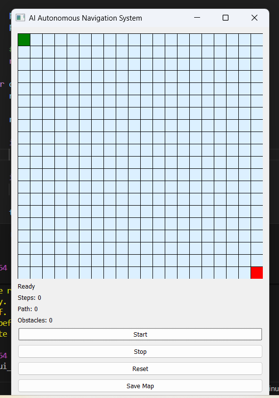
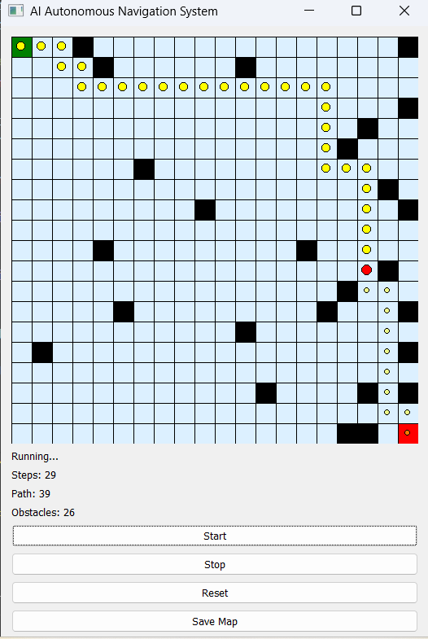

# 🚗 AI Autonomous Navigation System

## 📌 Overview

This project demonstrates an AI-based pathfinding system using multiple algorithms such as **A***, **BFS**, and **Dijkstra**. It provides an interactive GUI built with PyQt where users can create obstacles and visualize pathfinding in real-time.

---

## 🚀 Features

* 🔍 Multiple Algorithms: A*, BFS, Dijkstra
* 🎯 Real-time Path Visualization
* 🧠 AI Decision Making Simulation
* 🎨 Modern Dark UI (Tesla-inspired)
* 🧭 Arrow-based Agent Movement
* 📊 Step-by-step Animation

---

## 🛠️ Tech Stack

* Python
* PyQt5
* NumPy
* Matplotlib

---

## ▶️ How to Run

```bash
pip install -r requirements.txt
python -m src.gui_app
```

---

## 📷 Output Preview

(Add your screenshots here)

---

## 📈 Future Improvements

* Dynamic obstacles
* Live performance comparison graphs
* Web-based dashboard (Streamlit)

---


## 📷 Output Screenshots

### 🧭 Path Visualization
<p align="center">
  
</p>

### 🎨 Dark UI
<p align="center">
  
</p>
